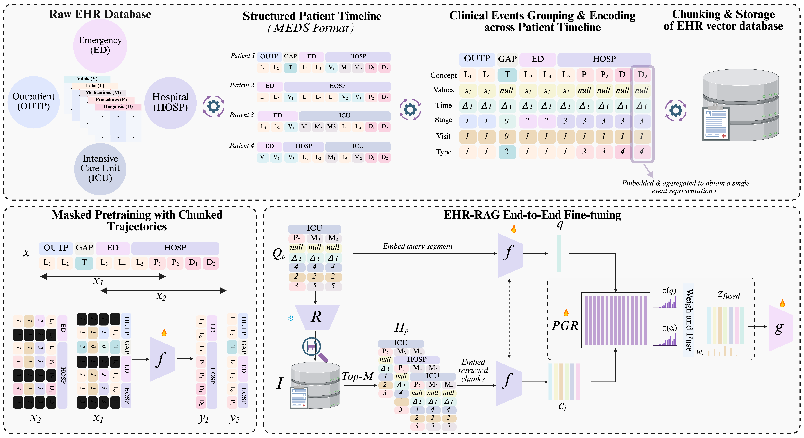

# EHR-RAGp: Retrieval-Augmented Prototype-Guided Foundation Model for Electronic Health Records


# Background

Electronic Health Records (EHR) contain rich longitudinal patient information and are widely used in predictive modeling applications. However, effectively leveraging historical data remains challenging due to long trajectories, heterogeneous events, temporal irregularity, and the varying relevance of past clinical context. Existing approaches often rely on fixed windows or uniform aggregation, which can obscure clinically important signals. In this work, we introduce \texttt{EHR-RAGp}, a retrieval-augmented foundation model that dynamically integrates the most relevant patient history across diverse clinical event types. We propose a prototype-guided retrieval module that acts as an alignment mechanism and estimates the relevance of retrieved historical chunks with respect to a given prediction task, guiding the model towards the most informative context. Across multiple clinical prediction tasks, \texttt{EHR-RAGp} consistently outperforms state-of-the-art EHR foundation model and transformer-based baselines. Furthermore, integrating \texttt{EHR-RAGp} with existing clinical foundation models yields substantial performance gains. Overall, \texttt{EHR-RAGp} provides a scalable and efficient framework for leveraging long-range clinical context to improve downstream performance.




# Environment Setup
To run this repo, you must install and run the libraries in the YAML file below.

```
conda env create -f environment.yml
conda activate ehr-rag
```

# Dataset
We conduct all experiments using [**MIMIC-IV**](https://physionet.org/content/mimiciv/3.1/) V3.1, a publicly available, de-identified critical care electronic health record (EHR) dataset.  Access to the dataset requires approval from the data provider after completing the required training and signing the usage agreement.  Hence, Raw data are not included in this repository and need to be downloaded by the user.


# MEDS Format
We convert the raw EHR records into a standardized **event-oriented format** using publicly available tools based on the  [MedicalEvent Data Standard (MEDS)](https://github.com/Medical-Event-Data-Standard).  
This conversion transforms the original tables into a consistent timeline representation, which serves as input for model training and evaluation.
We leverage the official MEDS export tool available for MIMIC-IV V3.1, [MIMIC_IV_MEDS](https://github.com/Medical-Event-Data-Standard/MIMIC_IV_MEDS/tree/main/src/MIMIC_IV_MEDS)

# Experiments
We provide the code for submission purposes. Exact training and evaluation configuration files will be uploaded upon acceptance. They are removed to avoid any identity-revealing information that can be forgotten upon submission. 
## Pretraining

To run pretraining experiments
```
python pretrain.py
```
## Baselines training (hyperparameters tuning)

To run hyperparameter experiments
```
python wo_hparams_opt.py
```

## EHR-RAG training (hyperparameters tuning)

To run hyperparameter tuning experiments
```
python w_hparams_opt.py
```

## Downstream evaluation

To run hyperparameter experiments
```
python final_eval.py
```

# Citation

If you use our code, kindly cite our paper:
```
#TODO
```


