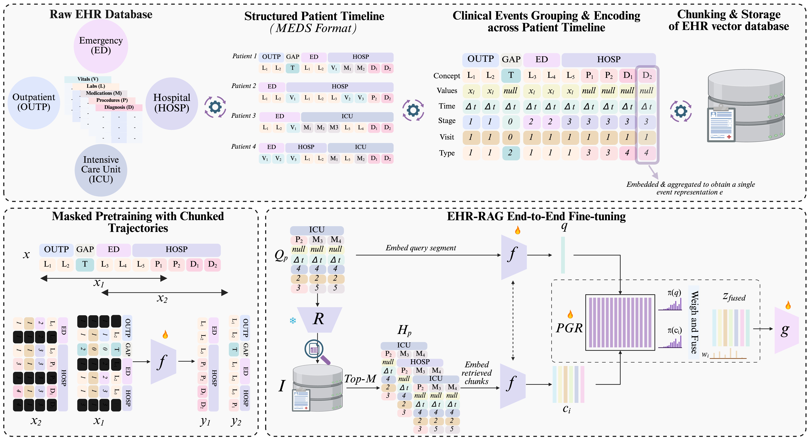

# EHR-RAGp: Prototype-Guided Retrieval of Longitudinal Electronic Health Records for Clinical Prediction Models

<p align="center">
  
</p>

EHR-RAGp is a retrieval-augmented framework for structured electronic health
records. It represents a patient's current state as a query, retrieves relevant
segments from the patient's longitudinal history, aligns query and history
representations through latent prototypes, and fuses them for downstream
clinical prediction.

## Contents

- [Highlights](#highlights)
- [Repository layout](#repository-layout)
- [Installation](#installation)
- [Data access and MEDS conversion](#data-access-and-meds-conversion)
- [End-to-end workflow](#end-to-end-workflow)
  - [1. Preprocess the data](#1-preprocess-the-data)
  - [2. Pretrain an encoder](#2-pretrain-an-encoder)
  - [3. Build FAISS indices](#3-build-faiss-indices)
  - [4. Train baselines](#4-train-baselines)
  - [5. Train EHR-RAGp](#5-train-ehr-ragp)
- [Retrieval configuration](#retrieval-configuration)
- [Tasks and evaluation](#tasks-and-evaluation)
- [Reproducibility and hardware](#reproducibility-and-hardware)
- [Citation](#citation)
- [Acknowledgements](#acknowledgements)

## Highlights

- Retrieval over a patient's own longitudinal EHR history
- Prototype-guided alignment and fusion
- Overlapping, time-based, visit-level, and care-stage chunking
- Token, event-type, visit, care-stage, time, and numeric features
- MEDS-based preprocessing for MIMIC-IV
- Transformer and clinical foundation-model baselines
- FAISS inner-product search over L2-normalized embeddings (cosine similarity)

## Repository layout

```text
EHR-RAGp/
├── assets/                       Figures used in this README
├── data/                         Local data and generated Arrow datasets
├── resources/                    Vocabulary and cohort/index Parquet files
├── slurm/scripts/                Reproducible SLURM job templates
├── src/
│   ├── data/                     Datasets, collators, and preprocessing utilities
│   ├── models/                   Model, embedding, fusion, and training modules
│   └── vectordb/                 FAISS index construction utilities
├── preprocess.py                 End-to-end post-MEDS preprocessing
├── pretrain.py                   Encoder pretraining entry point
├── create_vdb_idx.py             Per-stay FAISS index generation
├── train_baselines.py            Baseline tuning and evaluation
├── train_ehr_ragp.py             Retrieval-augmented tuning and evaluation
├── environment.yml               Conda environment specification
└── README.md
```

Large datasets, checkpoints, experiment outputs, and FAISS indices are local
artifacts and are not distributed with the repository.

## Installation

Create and activate the provided Conda environment:

```bash
conda env create -f environment.yml
conda activate ehr-ragp
```

The environment includes PyTorch with CUDA support, Hugging Face Transformers
and Datasets, Lightning, Polars, FAISS, FEMR, Optuna, and Weights & Biases.
Ensure that the CUDA version in `environment.yml` is compatible with the host
driver.

## Data access and MEDS conversion

Experiments use [MIMIC-IV v3.1](https://physionet.org/content/mimiciv/3.1/).
Access requires a PhysioNet account, the required CITI training, and acceptance
of the data-use agreement. Raw patient data are not included in this repository.

First convert MIMIC-IV to the Medical Event Data Standard using
[MIMIC-IV-MEDS](https://github.com/Medical-Event-Data-Standard/MIMIC_IV_MEDS)
version 0.1.2. Place the resulting dataset at:

```text
data/MEDS_output/
├── data/
└── metadata/
```

The preprocessing pipeline expects this layout and executes its stages in
order.

## End-to-end workflow

### 1. Preprocess the data

Run from the repository root:

```bash
python preprocess.py
```

For SLURM environments, use the provided template:

```bash
sbatch slurm/scripts/preprocess.sh
```

The pipeline:

1. Removes HCPCS events currently excluded to avoid temporal leakage.
2. Converts eligible OMR text measurements to numeric values.
3. Assigns care stages and visit identifiers.
4. Inserts time-gap tokens and event-type annotations.
5. Removes numeric outliers and rare events.
6. Normalizes numeric values.
7. Builds `resources/vocab.json`.
8. Builds `resources/pretrain_index.parquet`.
9. Saves the tokenized dataset to `data/meds_normalized_arrow/`.
10. Builds downstream cohort and boundary files, including
    `resources/downstream_index.parquet`.

Stages with existing outputs may be skipped. Remove or relocate stale outputs
deliberately before rebuilding a stage.

### 2. Pretrain an encoder

`pretrain.py` reads data paths and model selection from environment variables
and optimization settings from command-line arguments:

```bash
export TOKENIZER_PATH="./resources/vocab.json"
export DATA_PATH="./data/meds_normalized_arrow"
export DATA_IDX_PATH="./resources/pretrain_index.parquet"
export LOG_DIR="./models/pretraining"
export VERSION="roberta-mlm"
export PRETRAIN_MODE="mlm"
export BACKBONE="roberta"
export BASELINE="transformer"
export WANDB_API_KEY="YOUR_WANDB_API_KEY"

torchrun --nproc_per_node=4 pretrain.py \
  --learning-rate 2.29e-5 \
  --weight-decay 1e-2 \
  --max-epochs 100 \
  --batch-size 16 \
  --chunk-length 1024 \
  --overlap 128
```

The complete HPC template is available at
[`slurm/scripts/pretrain.sh`](slurm/scripts/pretrain.sh).

### 3. Build FAISS indices

Each prediction example receives a separate FAISS index. History-chunk
embeddings are stored first and the query embedding is stored last. Embeddings
are L2-normalized and indexed with `IndexFlatIP`, which implements cosine
similarity for these vectors.

All path arguments below are required:

```bash
python create_vdb_idx.py \
  --data-idx-path ./resources/downstream_index.parquet \
  --hf-dataset-path ./data/meds_normalized_arrow \
  --tokenizer-path ./resources/vocab.json \
  --ckpt-path /path/to/encoder.ckpt \
  --storage-path /path/to/faiss \
  --embedder-model roberta \
  --seq-length-q 1024 \
  --overlap-q 0 \
  --use-type \
  --use-visit \
  --use-stage
```

Add `--use-time` and `--use-numeric` only when those modules exist in the
checkpoint and the corresponding dataset columns are available.

The script builds all configured query windows and history chunking settings:

- Overlap: 256/32, 512/64, and 1024/128 token length/overlap
- Time: 6, 12, and 24 hour windows
- Visit-level chunks
- Care-stage-level chunks

The output layout is:

```text
<storage-path>/<query-length>/<strategy>/<span>/<window>/<icustay-id>.faiss
```

Generating one file per stay can exceed inode or file-count quotas on shared
filesystems. The project SLURM template uses a Singularity overlay for this
reason; see [`slurm/scripts/create-faiss-index.sh`](slurm/scripts/create-faiss-index.sh).

### 4. Train baselines

Baseline tuning and final evaluation share the `train_baselines.py` entry
point. Set `--run-mode hparams` for Optuna tuning or `--run-mode eval` for final
evaluation.

Example for a RoBERTa mortality model:

```bash
python train_baselines.py \
  --backbone-name roberta \
  --task y_mort \
  --main-window within48_query \
  --data-path ./data/meds_normalized_arrow \
  --data-idx-path ./resources/downstream_index.parquet \
  --tokenizer-path ./resources/vocab.json \
  --ckpt-path /path/to/roberta.ckpt \
  --seq-length 1024 \
  --seq-overlap 0 \
  --batch-size 16 \
  --wandb-log-dir ./models/hparams \
  --project-name ehr-ragp-tuning \
  --version roberta-baseline \
  --run-mode hparams \
  --use-time --use-numeric --use-stage --use-visit --use-type
```

The baseline script contains model-specific branches. Use
[`slurm/scripts/train_baselines.sh`](slurm/scripts/train_baselines.sh) as the
authoritative template for the selected backbone.

### 5. Train EHR-RAGp

Example using 256-token overlapping history chunks:

```bash
torchrun --nproc_per_node=1 train_ehr_ragp.py \
  --backbone-name roberta \
  --task y_mort \
  --data-idx-path ./resources/downstream_index.parquet \
  --data-path ./data/meds_normalized_arrow \
  --tokenizer-path ./resources/vocab.json \
  --seq-length-q 1024 \
  --overlap-q 0 \
  --main-window-query within48_query \
  --main-window-history within48_hist_full \
  --ckpt-path /path/to/roberta.ckpt \
  --chunking-strategy overlap \
  --span 256 \
  --benchmark mimic \
  --wandb-log-dir ./models/ehr-ragp \
  --project-name ehr-ragp \
  --version retrieval
```

Add `--use-prototypes` to enable prototype-guided alignment. Add `--uniform`
to replace FAISS retrieval with random history sampling for a uniform-retrieval
baseline. Without `--uniform`, the dataset reads the per-stay FAISS indices.

See [`slurm/scripts/train_ehr-ragp.sh`](slurm/scripts/train_ehr-ragp.sh) for the
complete HPC command and model variants.

## Retrieval configuration

`--chunking-strategy` supports:

| Strategy | `--span` | Description |
|---|---:|---|
| `overlap` | `256`, `512`, or `1024` | Fixed-length chunks with configured token overlap |
| `time` | `6.0`, `12.0`, or `24.0` | Events grouped into fixed-hour windows |
| `visit` | `256` | Events grouped by visit and split to the model context length |
| `care_stage` | `256` | Events grouped by visit and care stage |

The query length, history strategy, span, window, tokenizer, source dataset,
and feature configuration used during training must match index construction.
FAISS indices do not currently contain a configuration manifest, so mismatches
cannot be detected automatically.

## Tasks and evaluation

The MIMIC-IV workflow supports:

| CLI task | Prediction target | Query/history window |
|---|---|---|
| `y_mort` | In-hospital mortality | First 48 hours |
| `y_los_7` | Length of stay greater than 7 days | First 24 hours |
| `y_icu_readmit_30` | ICU readmission within 30 days | Inpatient stay |
| `y_mort_12mo` | Mortality within 12 months | Inpatient stay |

Training reports AUROC and AUPRC. Final evaluation also writes prediction files
under the configured run directory and computes bootstrap confidence intervals.
Patient-level splits are generated during preprocessing, and the pretraining
index is restricted to the training split.

## Reproducibility and hardware

- The default random seed is `24`.
- Hyperparameter search uses Optuna.
- Experiment tracking uses Weights & Biases.
- Splits are patient-level, and test patients are excluded from pretraining.
- Pretraining was designed for multiple high-memory GPUs.
- Downstream experiments can run on one high-memory GPU with an appropriate
  batch size.

The supplied SLURM scripts contain cluster-specific partitions, container
paths, overlay paths, and GPU requests. Adapt these values before submitting
jobs on another system. Never commit API keys or protected dataset paths.

## Citation

TBA

## Acknowledgements

This project builds on MIMIC-IV, PhysioNet, MEDS, Hugging Face Transformers,
FAISS, and the broader clinical machine-learning ecosystem. We thank the MEDS
contributors.
